# Whisk & Wonder Backend API


A production-oriented RESTful backend API for a luxury afternoon tea reservation and ordering platform built with NestJS, Prisma ORM, PostgreSQL, and JWT authentication with HttpOnly cookie support.

The backend powers customer reservations, ordering workflows, payment management, and role-based admin operations for the Whisk & Wonder hospitality platform.

---

## Table of Contents

- [Project Overview](#project-overview)
- [Deployment Links](#deployment-links)
- [Features](#features)
- [Tech Stack](#tech-stack)
- [Project Structure](#project-structure)
- [System Architecture](#system-architecture)
- [Reservation Flow](#reservation-flow)
- [Authentication Flow](#authentication-flow)
- [API Documentation](#api-module)
- [Authentication](#authentication)
- [Reservation System](#reservation-system)
- [Testing](#testing)
- [Environment Variables](#environment-variables)
- [Installation](#installation)
- [Available Scripts](#available-scripts)
- [Deployment Architecture](#deployment-architecture)

# Deployment Links

## Live Backend API

- Backend API: https://whiskandwonder.up.railway.app
- Swagger Documentation: https://whiskandwonder.up.railway.app/api

## Frontend Deployment

- Frontend URL: https://whiskandwonder.vercel.app

## Project Documentation

- Notion Documentation: https://noto.li/jeeuhC

## Presentation

- Canva Presentation: https://canva.link/whisknwonder

---

# System Architecture

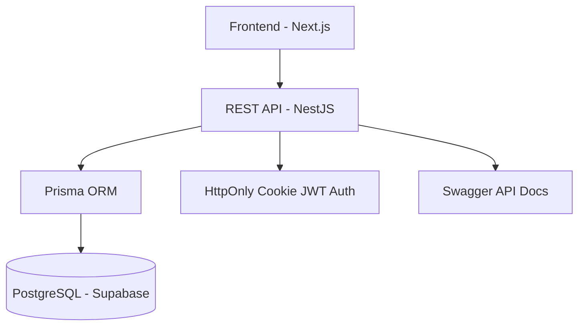

---

# Reservation Flow

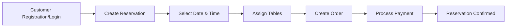

---

# Authentication Flow

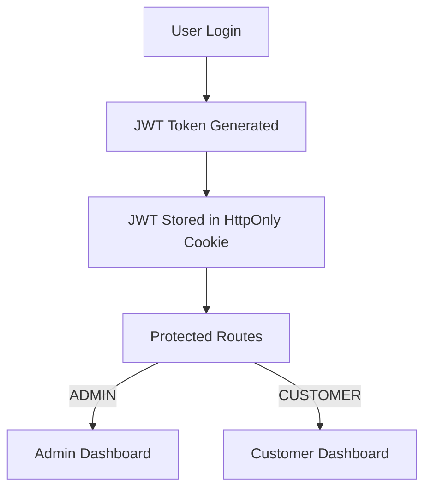

---

# Database Relationship Overview

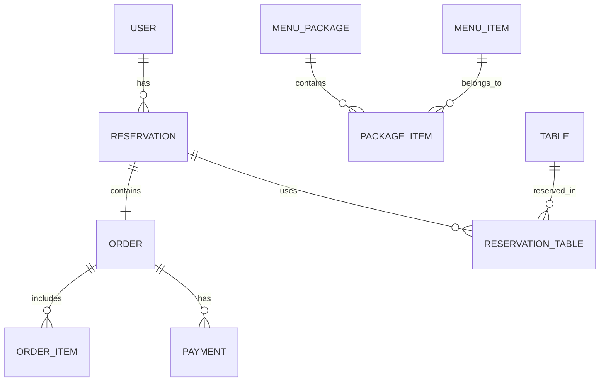

# Features

## Authentication & Security

- JWT Authentication with HttpOnly Cookies
- Role-Based Authorization
- Protected Routes using Guards
- Password Hashing with bcrypt
- Optional JWT Guest Access
- DTO Validation using class-validator
- Global ValidationPipe
- Unauthorized Access Protection

---

## Reservation System

- Guest Reservation Support
- Authenticated Reservation Flow
- Reservation Code Generation
- Reservation Reschedule
- Reservation Cancellation
- Reservation Status Management
- Reservation Ownership Validation
- Reservation Date Validation
- Reservation with Order Creation

---

## Tables Management

- Table CRUD Operations
- Table Availability Management
- Table Capacity Management
- Admin Table Controls

---

## Menu & Package Management

- Menu Item CRUD Operations
- Menu Package CRUD Operations
- Package Composition System
- Menu Availability Status
- Image URL Support
- Category-Based Menu Organization

---

## Order System

- Reservation-Based Orders
- Order Item Validation
- Menu & Package Ordering
- Dynamic Subtotal Calculation
- Tax Calculation
- Order Status Management
- Customer Order Tracking

---

## Payment System

- Deposit & Full Payment Support
- Payment Status Management
- Refund Handling
- Failed Payment Handling
- Remaining Balance Validation
- Multiple Payment Methods

---

## Dashboard System

### Admin Dashboard

- Reservation Monitoring
- Orders Overview
- Payments Monitoring
- Table Management
- Menu Management

### Customer Dashboard

- Reservation Tracking
- Order History
- Payment History
- Profile Management

---

# Tech Stack

- NestJS
- TypeScript
- Prisma ORM
- PostgreSQL
- Supabase
- Railway
- JWT Authentication
- Passport.js
- Swagger / OpenAPI
- class-validator
- bcrypt

---

# Deployment Architecture

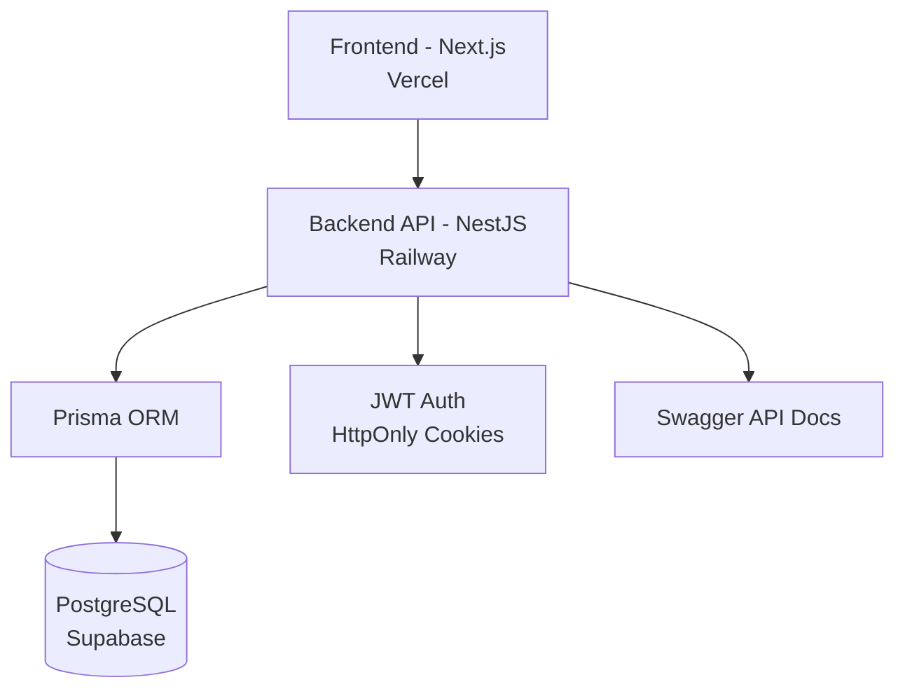

## Project Structure

```txt
src
├── app.controller.spec.ts
├── app.controller.ts
├── app.module.ts
├── app.service.spec.ts
├── app.service.ts
├── auth
│   ├── auth.controller.spec.ts
│   ├── auth.controller.ts
│   ├── auth.module.ts
│   ├── auth.service.spec.ts
│   ├── auth.service.ts
│   ├── dto
│   │   ├── login.dto.ts
│   │   └── register.dto.ts
│   ├── jwt-auth.guard.ts
│   ├── jwt.strategy.ts
│   ├── optional-jwt-auth.guard.ts
│   ├── roles.decorator.ts
│   └── roles.guard.ts
├── dashboard
│   ├── dashboard.controller.spec.ts
│   ├── dashboard.controller.ts
│   ├── dashboard.module.ts
│   ├── dashboard.service.spec.ts
│   └── dashboard.service.ts
├── main.ts
├── menus
│   ├── dto
│   │   ├── create-menu-item.dto.ts
│   │   ├── create-menu-package.dto.ts
│   │   ├── update-menu-item.dto.ts
│   │   └── update-menu-package.dto.ts
│   ├── menus.controller.spec.ts
│   ├── menus.controller.ts
│   ├── menus.module.ts
│   ├── menus.service.spec.ts
│   └── menus.service.ts
├── orders
│   ├── dto
│   │   ├── create-order.dto.ts
│   │   └── update-order-status.dto.ts
│   ├── orders.controller.spec.ts
│   ├── orders.controller.ts
│   ├── orders.module.ts
│   ├── orders.service.spec.ts
│   └── orders.service.ts
├── payments
│   ├── dto
│   │   └── create-payment.dto.ts
│   ├── payments.controller.spec.ts
│   ├── payments.controller.ts
│   ├── payments.module.ts
│   ├── payments.service.spec.ts
│   └── payments.service.ts
├── prisma
│   ├── prisma.module.ts
│   └── prisma.service.ts
├── reservations
│   ├── dto
│   │   ├── create-reservation-with-order.dto.ts
│   │   ├── create-reservation.dto.ts
│   │   └── update-reservation.dto.ts
│   ├── reservations.controller.spec.ts
│   ├── reservations.controller.ts
│   ├── reservations.module.ts
│   ├── reservations.service.spec.ts
│   └── reservations.service.ts
├── tables
│   ├── tables.controller.spec.ts
│   ├── tables.controller.ts
│   ├── tables.module.ts
│   ├── tables.service.spec.ts
│   └── tables.service.ts
└── users
    ├── dto
    │   └── update-profile.dto.ts
    ├── users.controller.spec.ts
    ├── users.controller.ts
    ├── users.module.ts
    ├── users.service.spec.ts
    └── users.service.ts

16 directories, 66 files
```

---

# API Modules

| Module       | Description                           |
| ------------ | ------------------------------------- |
| Auth         | Authentication & authorization        |
| Users        | User profile management               |
| Reservations | Reservation management system         |
| Tables       | Tables management                     |
| Menus        | Menu items & package management       |
| Orders       | Customer ordering workflow            |
| Payments     | Payment & refund handling             |
| Dashboard    | Admin & customer dashboard statistics |

---

# Main API Endpoints

## Authentication

| Method | Endpoint       | Description       |
| ------ | -------------- | ----------------- |
| POST   | /auth/register | User registration |
| POST   | /auth/login    | User login        |
| POST   | /auth/logout   | User logout       |
| GET    | /auth/me       | Get current user  |

---

## Reservations

| Method | Endpoint                            | Description                   |
| ------ | ----------------------------------- | ----------------------------- |
| POST   | /reservations                       | Create reservation            |
| POST   | /reservations/with-order            | Create reservation with order |
| GET    | /reservations                       | Get all reservations (Admin)  |
| GET    | /reservations/my                    | Get customer reservations     |
| GET    | /reservations/code/:reservationCode | Find reservation by code      |
| PATCH  | /reservations/:id                   | Update reservation            |
| PATCH  | /reservations/:id/reschedule        | Reschedule reservation        |
| PATCH  | /reservations/:id/cancel            | Cancel reservation            |

---

## Orders

| Method | Endpoint           | Description            |
| ------ | ------------------ | ---------------------- |
| POST   | /orders            | Create order (Admin)   |
| POST   | /orders/my         | Create customer order  |
| GET    | /orders            | Get all orders (Admin) |
| GET    | /orders/my         | Get customer orders    |
| PATCH  | /orders/:id/status | Update order status    |
| PATCH  | /orders/:id/cancel | Cancel order           |

---

## Payments

| Method | Endpoint             | Description              |
| ------ | -------------------- | ------------------------ |
| POST   | /payments            | Create payment           |
| GET    | /payments            | Get all payments (Admin) |
| GET    | /payments/my         | Get customer payments    |
| PATCH  | /payments/:id/refund | Refund payment           |
| PATCH  | /payments/:id/fail   | Mark payment as failed   |

---

# Authentication & Authorization

The backend uses JWT-based authentication with HttpOnly cookie support and role-based route protection.

After login, the access token is stored in an HttpOnly cookie to reduce exposure to client-side JavaScript. The JWT strategy also supports Bearer token fallback for API testing through Swagger or Postman.

Security layers include:

- HttpOnly cookie-based JWT authentication
- Cookie-first JWT extraction
- Optional Bearer token fallback
- JwtAuthGuard
- OptionalJwtAuthGuard
- RolesGuard
- @Roles() decorator
- bcrypt password hashing
- DTO validation
- Protected admin routes

---

# Business Rules & Validation

The system includes business-oriented validation and error handling such as:

- Reservation date cannot be in the past
- Invalid reservation time prevention
- Table name uniqueness validation
- Order must contain at least one item
- Quantity must be greater than zero
- Payment amount cannot exceed remaining balance
- Reservation ownership validation
- Admin-only route protection
- Invalid menu item/package prevention
- Duplicate email registration prevention

---

# Error Handling

Custom HTTP exceptions are implemented across services:

- BadRequestException
- UnauthorizedException
- ForbiddenException
- NotFoundException

This ensures consistent API responses and safer request handling.

---

# Database Design

Main relational architecture:

- One User can have many Reservations
- One Reservation can contain one Order
- One Order can contain many Order Items
- One Menu Package can contain many Menu Items
- One Order can contain multiple Payments
- Tables are connected through ReservationTable pivot relations

---

# ERD (Entity Relationship Diagram)

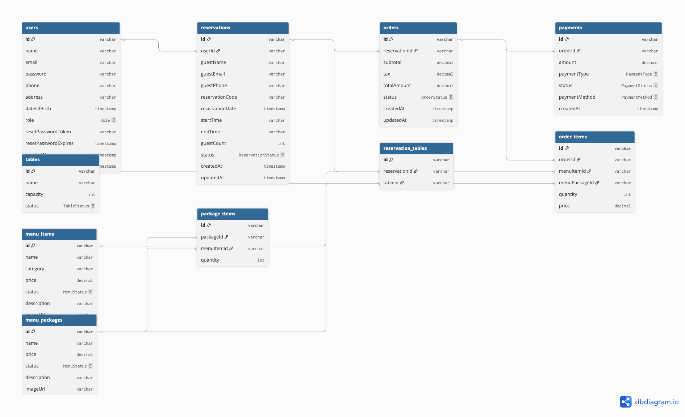

---

# Installation

```bash
npm install
```

---

# Environment Variables

Create `.env` file:

```env
DATABASE_URL=
JWT_SECRET=
```

---

# Run Application

## Development

```bash
npm run start:dev
```

## Production

```bash
npm run build
npm run start:prod
```

---

# Prisma Commands

## Generate Prisma Client

```bash
npx prisma generate
```

## Run Migration

```bash
npx prisma migrate dev
```

## Open Prisma Studio

```bash
npx prisma studio
```

---

# Testing

The backend system has been tested using:

- Swagger API Documentation
- Postman API Testing
- Prisma Studio Validation
- Manual Endpoint Validation
- Service & Controller Spec Files

---

## Unit Testing

This project includes unit testing using Jest for both service and controller layers.

### Testing Stack

- Jest
- ts-jest
- @nestjs/testing

### Run All Tests

```bash
npm run test
```

### Run Coverage Report

```bash
npm run test:cov
```

### Current Coverage

| Metric     | Coverage |
| ---------- | -------- |
| Statements | 82.11%   |
| Branches   | 77.42%   |
| Functions  | 88.81%   |
| Lines      | 83.81%   |

## Coverage Report

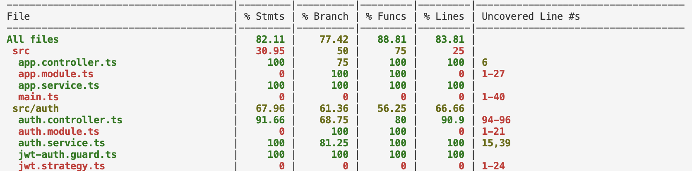

### Test Summary

- 18 Test Suites Passed
- 133 Tests Passed
- 0 Snapshot Failures

### Tested Modules

#### Service Layer

- AuthService
- ReservationsService
- OrdersService
- PaymentsService
- MenusService
- TablesService
- UsersService
- DashboardService

#### Controller Layer

- AuthController
- ReservationsController
- OrdersController
- PaymentsController
- MenusController
- TablesController
- UsersController
- DashboardController

### Testing Features Covered

- Authentication logic
- Reservation validation
- Table allocation logic
- Reservation rescheduling & cancellation
- Order subtotal & tax calculation
- Payment processing & refund flow
- User profile updates
- Dashboard summary aggregation
- Authorization & role validation
- Controller-service interaction
- Error handling scenarios

# Demo Accounts

## Admin Account

```txt
Email: admin@whiskandwonder.com
Password: admin123
```

## Customer Account

```txt
Email: swifties@mail.com
Password: password123
```

---

# API Documentation Preview

Swagger API documentation is available at:

https://whiskandwonder.up.railway.app/api

---

# Frontend Deployment

Frontend application:

https://whiskandwonder.vercel.app

---

# Current Status

- ✅ Authentication System Completed
- ✅ Reservation System Completed
- ✅ Orders System Completed
- ✅ Payments System Completed
- ✅ Admin Dashboard API Completed
- ✅ Customer Dashboard API Completed
- ✅ JWT Authorization Completed
- ✅ Role-Based Access Control Completed
- ✅ Prisma ORM Integration Completed
- ✅ PostgreSQL Database Integration Completed
- ✅ Swagger Documentation Completed
- ✅ Railway Deployment Completed
- ✅ Production-ready MVP Completed

---

# Future Improvements

- Cloudinary Image Upload Integration
- Online Payment Gateway
- Email Notification System
- Reservation Availability Calendar
- Advanced Dashboard Analytics
- Real-time Table Availability
- Automated Unit & Integration Testing
- Multi-language Support
- Google OAuth Authentication
- WebSocket Real-time Features

---

# Screenshots

## Swagger Documentation

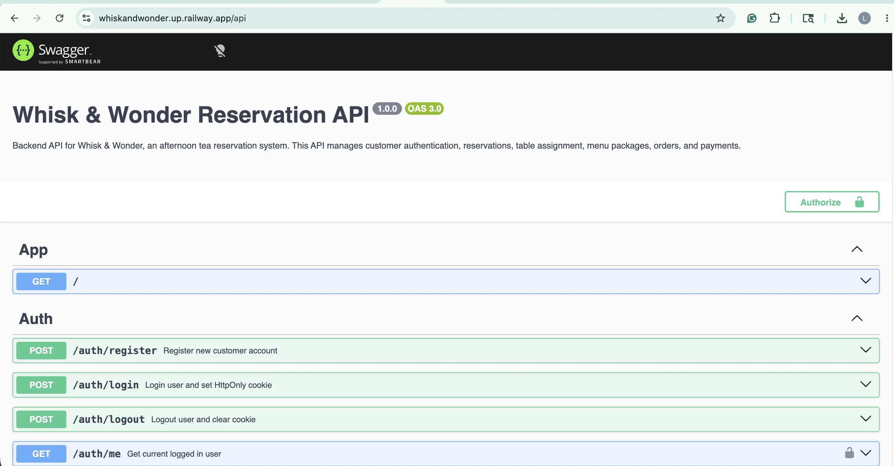

## Landing Page

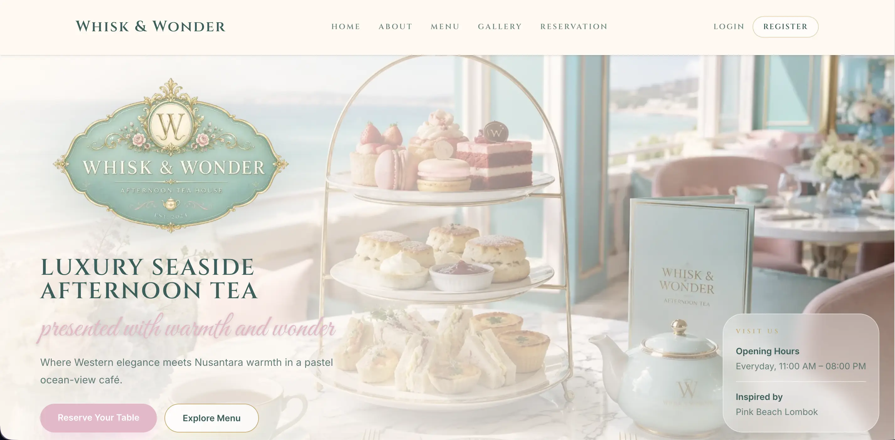

## Admin Dashboard

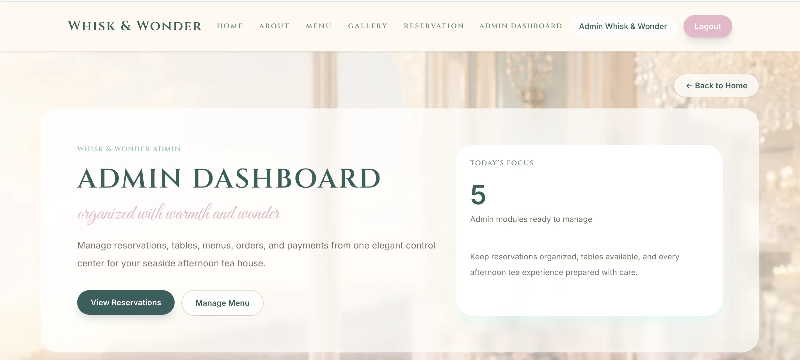

## Customer Dashboard

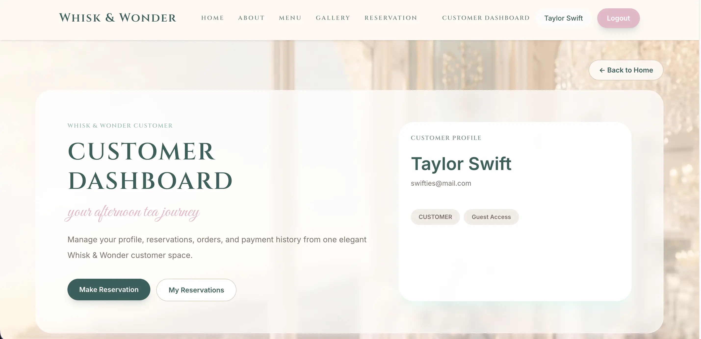

## Guest Reservation

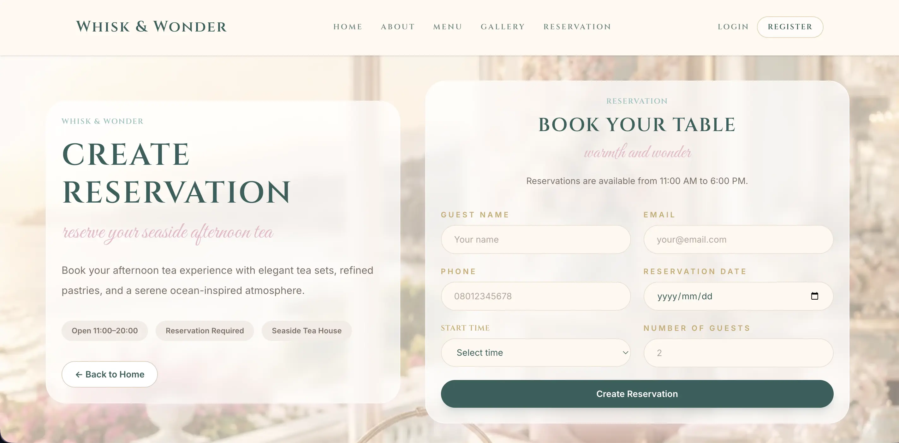

---

# Project Goal

This project demonstrates:

- RESTful API architecture
- Modular backend development
- Production-oriented backend structure
- JWT authentication workflow
- Role-based authorization
- Relational database modeling
- Prisma ORM implementation
- DTO validation patterns
- Backend business logic handling
- API documentation using Swagger
- Deployment-ready backend engineering

---

# Documentation

Additional project documentation is available inside:

```txt
/docs
```
