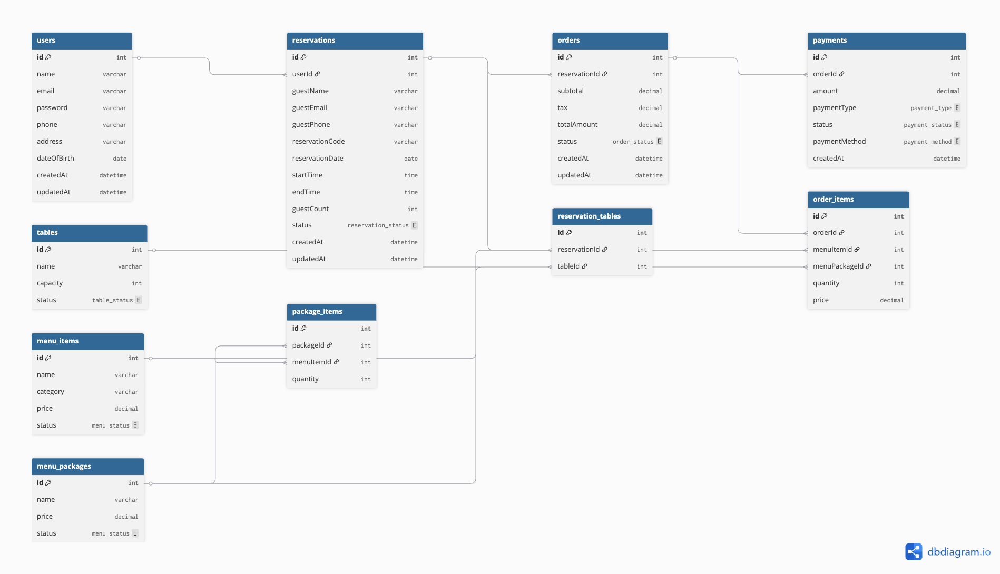

# Whisk & Wonder Backend API

A RESTful backend API for an elegant afternoon tea reservation and ordering platform built with NestJS, Prisma, PostgreSQL, and JWT authentication.

---

## Deployment Links

### Live Backend API

The backend API has been deployed using Railway.

- Live API: https://whiskandwonder.up.railway.app
- Swagger Documentation: https://whiskandwonder.up.railway.app/api

### Project Documentation

- Notion Documentation: https://noto.li/jeeuhC

### Frontend Deployment

- Frontend URL: [Under Construction](https://whiskandwonder.vercel.app/)

### Presentation

- Canva Presentation: [Under Construction]

---

## Features

- JWT Authentication
- Role-Based Authorization
- Reservation System
- Table Management
- Menu & Package Management
- Order System
- Payment System
- User Profile Management
- DTO Validation
- Swagger API Documentation

---

## Tech Stack

- NestJS
- TypeScript
- Prisma ORM
- PostgreSQL / Supabase
- JWT Authentication
- Swagger / OpenAPI

---

## Project Structure

```txt
src/
├── auth/
├── users/
├── reservations/
├── tables/
├── menus/
├── orders/
├── payments/
├── prisma/
└── common/

docs/
├── 00_PROJECT_OVERVIEW
├── 01_FOUNDATION
├── 02_AUTH_SYSTEM
├── 03_RESERVATION_SYSTEM
├── 04_ADMIN_SYSTEM
├── 05_COMMUNICATION_SYSTEM
├── 06_ADVANCED_FEATURES
├── 07_TESTING_SECURITY
└── 08_DEPLOYMENT
```

## ERD (Entity Relationship Diagram)

## 

## Installation

```bash
npm install
```

---

## Environment Variables

Create `.env` file:

```env
DATABASE_URL=
JWT_SECRET=
```

---

## Run Application

Development:

```bash
npm run start:dev
```

Production:

```bash
npm run build
npm run start:prod
```

---

## Prisma Commands

Generate Prisma Client:

```bash
npx prisma generate
```

Run Migration:

```bash
npx prisma migrate dev
```

Open Prisma Studio:

```bash
npx prisma studio
```

---

## Authentication

This API uses JWT authentication.

Example protected route header:

```http
Authorization: Bearer <access_token>
```

---

## Main Modules

| Module       | Description                    |
| ------------ | ------------------------------ |
| Auth         | Authentication & authorization |
| Users        | User profile management        |
| Reservations | Reservation system             |
| Tables       | Table management               |
| Menus        | Menu & package management      |
| Orders       | Customer ordering system       |
| Payments     | Payment management             |

---

## Project Goal

This project demonstrates:

- RESTful API development
- Modular backend architecture
- JWT authentication
- Role-based authorization
- DTO validation
- Relational database management
- Swagger API documentation
- Production-oriented backend structure

---

## Documentation

Detailed documentation is available inside:

```txt
/docs
```

---

## Current Status

Backend core system completed.
